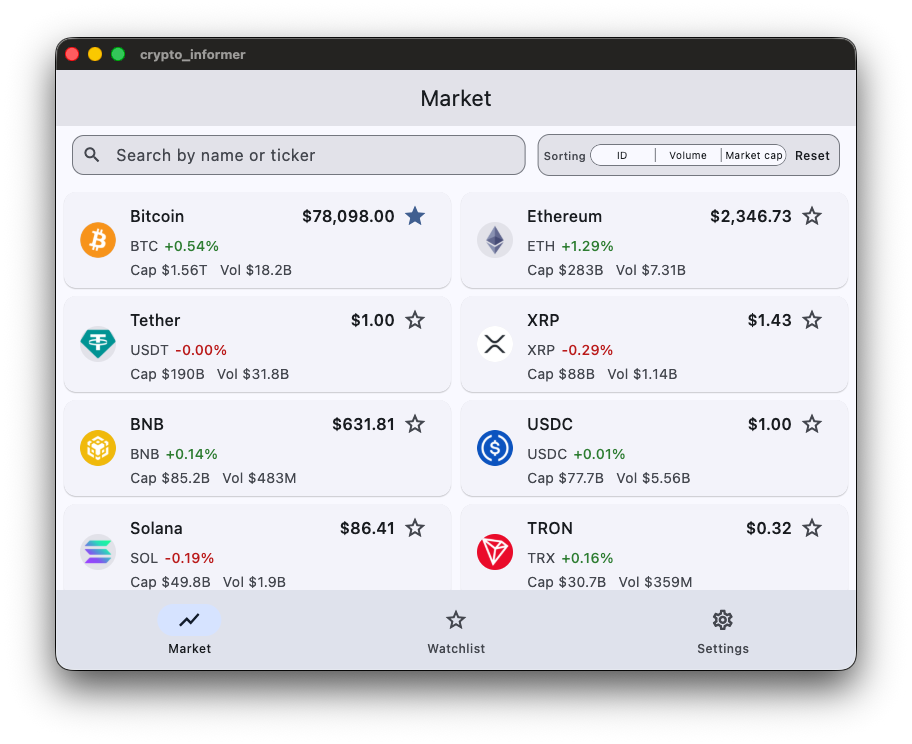
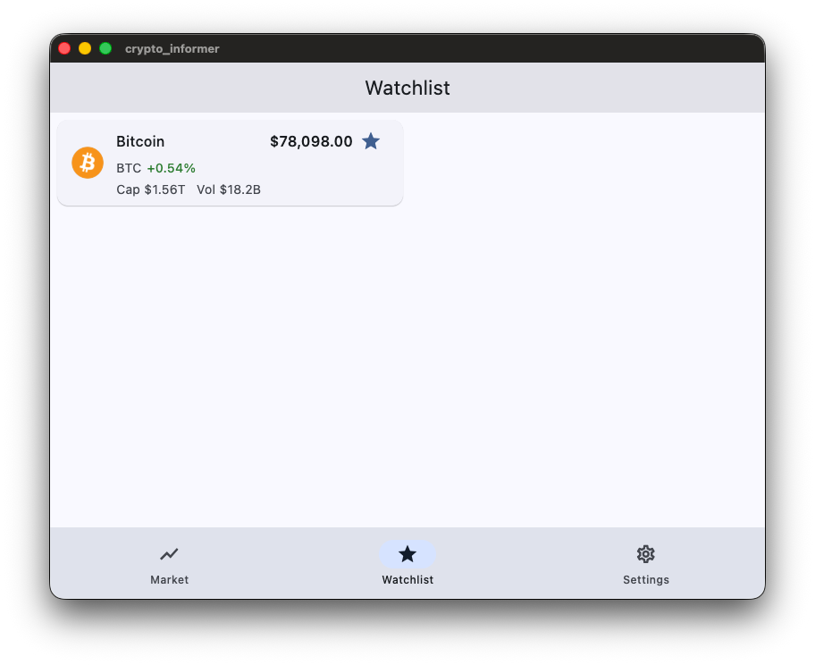
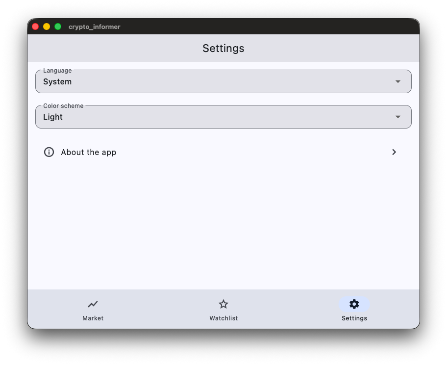

# Мобильное приложение для мониторинга криптовалютного рынка

`Crypto Informer` — курсовой проект OTUS: Flutter-приложение для мониторинга криптовалютного рынка с курсами, графиками, избранным, уведомлениями и offline-first поведением.

## Возможности

- **Рынок** — список активов с ценой в USD и изменением за 24 часа; доступны поиск, сортировка, pull-to-refresh и дозагрузка при прокрутке. Данные загружаются из публичного API CoinGecko (действуют лимиты запросов).
- **Деталь монеты** — описание, текущая цена и изменение за 24ч; **график цены в USD** (`fl_chart`) с выбором периода (1D, 7D, 30D, 90D, 1Y, MAX) через эндпоинт CoinGecko `market_chart`. История цен **загружается только при наличии сети** и **не кэшируется** в SQLite (в отличие от карточки монеты и списка рынка).
- **Избранное** — список отмеченных монет (хранение id в `SharedPreferences`).
- **Уведомления о цене** — для монеты можно задать порог выше/ниже текущей цены; при достижении порога приложение показывает in-app уведомление.
- **Настройки** — язык интерфейса (системный / English / Russian), светлая / тёмная / системная тема, диалог «О программе».
- **Offline-first** — успешные ответы API для **списка рынка** и **полной карточки монеты** кэшируются в **SQLite** (`sqflite`); без сети показываются последние сохранённые данные. **График цены** при офлайне недоступен (нужна сеть). Над нижней навигацией отображается баннер при отсутствии связи (`connectivity_plus`).
- **Локализация** — ARB-файлы в `lib/l10n/`, генерация через `flutter gen-l10n` (см. `l10n.yaml`).

## Скриншоты

| Рынок | Деталь монеты и график |
|:---:|:---:|
|  |  |

| Избранное | Настройки |
|:---:|:---:|
|  |  |

## Стек

| Область | Технологии |
|--------|------------|
| UI | Flutter, Material 3, графики — [`fl_chart`](https://pub.dev/packages/fl_chart) |
| Состояние | `flutter_bloc` (Cubit) |
| DI | `get_it` |
| Навигация | `go_router`, `StatefulShellRoute` |
| HTTP | `dio` + `retrofit` (REST-клиент с кодогенерацией) |
| Локальное хранилище | `sqflite`, `froom`, `shared_preferences` |
| Desktop SQLite | `sqflite_common_ffi` (инициализация в `main.dart`) |
| Тесты | `flutter_test`, `bloc_test`, `mocktail` |

Соглашение о том, почему текущий техстек намеренно отражается и в `README`, и в экране `About`, описано в [docs/tech-stack-sync.md](docs/tech-stack-sync.md).

## Требования

- Flutter SDK, совместимый с Dart **^3.10.1** (см. `pubspec.yaml`).

### Linux desktop

На Ubuntu/Debian для `flutter run -d linux` может понадобиться пакет **LLVM LLD** в той же версии, что и `clang` (иначе при сборке native assets для SQLite часто возникает ошибка `Failed to find any of [ld.lld, ld] in .../llvm-.../bin`). Пример:

```bash
sudo apt install lld-18
```

Подробности и типичные зависимости — **[docs/linux-setup.md](docs/linux-setup.md)**.

## Запуск

```bash
cd crypto_informer
flutter pub get
flutter gen-l10n   # при изменении .arb; часто выполняется при сборке
flutter run
```

Сборка под конкретную платформу — стандартными командами Flutter (`flutter run -d linux` и т.д.).

## Структура репозитория

```
lib/
  core/
    network/
      dio/        # Retrofit REST-клиент (Dio), инкапсуляция HTTP-транспорта
    di/           # service_locator (get_it) — DI через абстракции
    router/       # go_router
    database/     # SQLite (sqflite)
    ...           # тема, локализация, оболочка с навигацией
  features/       # market, watchlist, settings, about, alerts
  l10n/           # ARB и сгенерированные локализации
  main.dart
test/
docs/             # документация проекта
```

Приложение следует принципам **чистой архитектуры**: фичи разделены на `presentation`, `domain` и `data`, REST-клиент инкапсулирован в `core/network/dio/`, а зависимости прокидываются через абстракции и `get_it`. Структура `network/` подготовлена для расширения (например, `core/network/ws/` для вебсокетов).

Подробная структура слоёв внутри `features/` — в [docs/code-style.md](docs/code-style.md), раздел **«Структура фич»**.

## Кодстайл

Правила линтера, форматирования и соглашения по коду описаны в **[docs/code-style.md](docs/code-style.md)**.

Кратко: подключён пресет **very_good_analysis**; проверка — `flutter analyze` и `dart format`.

## Лицензия и публикация

Проект помечен как непубликуемый (`publish_to: 'none'` в `pubspec.yaml`).
